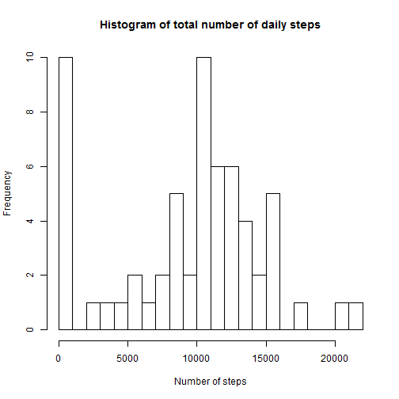
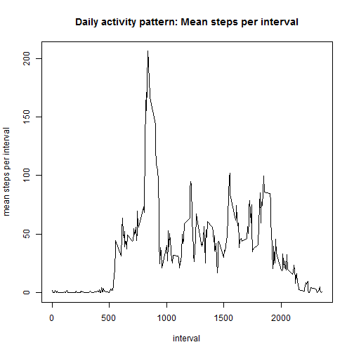
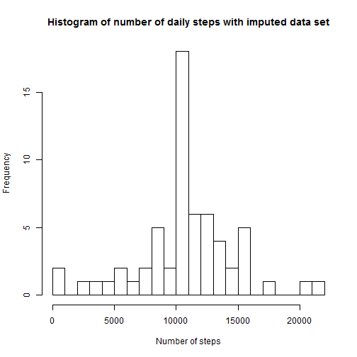

# Reproducible Research: Peer Assessment 1
  
  
   
## Loading and preprocessing the data


```r
setwd("D:/Users/ffruth/Documents/CourseraDataScienceSpecialization/R/class5")
activity <- read.csv(file = "activity.csv", sep=",", header = TRUE)

library(lubridate)
```
  
Convert the date column into a date format:

```r
activity[,"date"] <- ymd(activity[,"date"])
```
   
  
## What is mean total number of steps taken per day?  
a) histogram of the total number of steps taken each day  

```r
numbersteps <- tapply(activity$steps, activity$date, FUN = sum, na.rm=TRUE)
hist(numbersteps, breaks = 20, xlab = "Number of steps", main = "Histogram of total number of daily steps")
```


  
b) Calculation and report of mean and median total number of steps taken per day:

```r
meansteps <- mean(numbersteps)
mediansteps <- median(numbersteps)
paste0("The mean is equal to ",meansteps)
```

```
## [1] "The mean is equal to 9354.22950819672"
```

```r
paste0("The median is equal to ",mediansteps)
```

```
## [1] "The median is equal to 10395"
```
  
  
## What is the average daily activity pattern?
a) time series plot of the 5-minute interval (x-axis) and the average number of steps taken, averaged across all days (y-axis)

```r
stepsperint <- tapply(activity$steps, activity$interval, FUN = mean, na.rm=TRUE)
ints <- as.numeric(rownames(stepsperint))
dailyact <- cbind(ints, stepsperint)
colnames(dailyact) <- c("interval", "mean steps per interval")
plot(dailyact,type = "l", main = "Daily activity pattern: Mean steps per interval")
```


  
b) Which 5-minute interval, on average across all the days in the dataset, contains the maximum number of steps?

```r
maxint <- which.max(dailyact[,2])
dailyact[maxint,]
```

```
##                interval mean steps per interval 
##                835.0000                206.1698
```
  
  
## Imputing missing values  
a) Calculating the number of entries with NAs:

```r
length(which(is.na(activity$steps)))
```

```
## [1] 2304
```
 
b) Strategy for imputing missing data and creating a new data set "activity_imputed"  
  
  
Missing values (coded as "NA") are filled by filling in the mean of the respective 5-minute interval (calculated previously):  

```r
activity_imputed <- activity
for(i in 1:nrow(activity_imputed)){
        j <- which(dailyact[,1]==activity_imputed[i,3])
        if(is.na(activity_imputed$steps[i])) activity_imputed$steps[i] <- dailyact[j,2]
} 
```

c) Histogram of the total number of steps taken each day after missing values are imputed

```r
numbersteps_imp <- tapply(activity_imputed$steps, activity_imputed$date, FUN = sum, na.rm=TRUE)
hist(numbersteps_imp, breaks = 20, main = "Histogram of number of daily steps with imputed data set", xlab = "Number of steps")
```


  
d) Calculation and report of mean and median total number of steps taken per day

```r
meansteps_imp <- mean(numbersteps_imp)
mediansteps_imp <- median(numbersteps_imp)
paste0("The mean using impute data is equal to ", round(meansteps_imp))
```

```
## [1] "The mean using impute data is equal to 10766"
```

```r
paste0("The median using impute data is equal to ", round(mediansteps_imp))
```

```
## [1] "The median using impute data is equal to 10766"
```
  
  
Do these values differ from the estimates from the first part of the assignment?  
Both the median and the mean increase, however, the median only increases only slightly.  
  
What is the impact of imputing missing data on the estimates of the total daily number of steps?  
The median is rather robust regarding imputing which can be expected. The most drastic effect is that the frequency of small values is significantly reduced, i.e., days with a small number of steps due to missing data are now assigned to a higher number of steps.

## Are there differences in activity patterns between weekdays and weekends?  
a) Creation of a new factor variable "flag_weekend" indicating whether the respective day belongs to the weekend or not. Please note that "Samstag" and "Sonntag" are German words for "Saturday" and "Sunday" and are used here because the R system works with German standards.

```r
activity_imputed$flag_weekend <- (weekdays(activity_imputed$date) %in% c("Samstag","Sonntag"))
```
  
b) Plot containing a time series plot of the 5-minute interval (x-axis) and the average number of steps taken, averaged across all weekday days or weekend days (y-axis).  

```r
subs <- subset(activity_imputed, activity_imputed$flag_weekend==TRUE)
stepsperint <- tapply(subs$steps, subs$interval, FUN = mean, na.rm=TRUE)
ints <- as.numeric(rownames(stepsperint))
temp1 <- cbind(ints, stepsperint,rep("weekend",length(ints)))

subs <- subset(activity_imputed, activity_imputed$flag_weekend==FALSE)
stepsperint <- tapply(subs$steps, subs$interval, FUN = mean, na.rm=TRUE)
ints <- as.numeric(rownames(stepsperint))
temp2 <- cbind(ints, stepsperint,rep("weekday",length(ints)))

dailyact <- rbind(temp1, temp2)
colnames(dailyact) <- c("interv", "numsteps", "daytype")

dailyact <- as.data.frame(dailyact, warnings = FALSE)

for(i in 1:2) dailyact[,i] <- as.numeric(as.character(dailyact[,i]))
dailyact[,3] <- as.factor(as.character(dailyact[,3]))


library(ggplot2)
library(lattice)
par(mfrow=c(1,1))
xyplot(numsteps ~ interv | daytype, data = dailyact, layout = c(1, 2),type = c("l"),
       ylab = "Number of steps", xlab = "Interval") 
```


